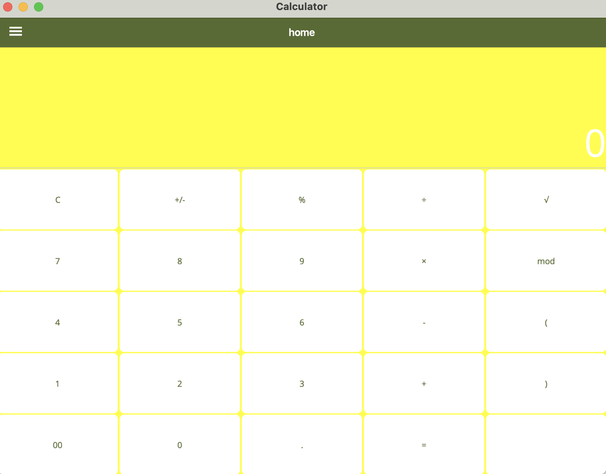
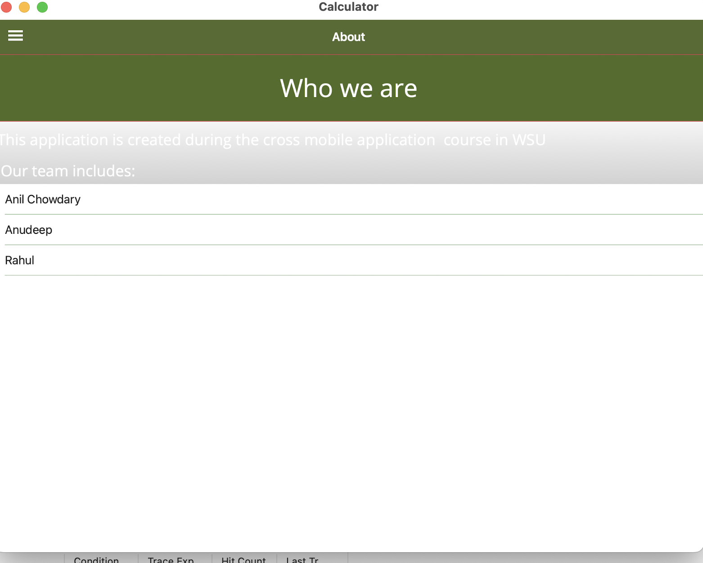

# Calculator Sample App

This basic calculator demonstrates using span and spacing features of a Grid layout to achieve a familiar interface.

For more information, see the [Grid documentation](https://docs.microsoft.com/dotnet/maui/user-interface/layouts/grid).

Anil Kumar Putta:
     Major commits: 1)UI buttons were added to MainPage.XAML.
                    2)for those new buttons in MainPage.XAML.CS, backend logic was developed.    

Anudeep:
     Major commits:
                    1)change styles.xaml for a better look.
                     2)modified UI button designs layouts

                    
Rahul:
     Major commits:
                       1)added AppShell.xaml and AppShell.xaml.cs for sidenav
                       2)Created About.xaml and About.xaml.cs for about page
                       3)Did connection routes with previous pages.
