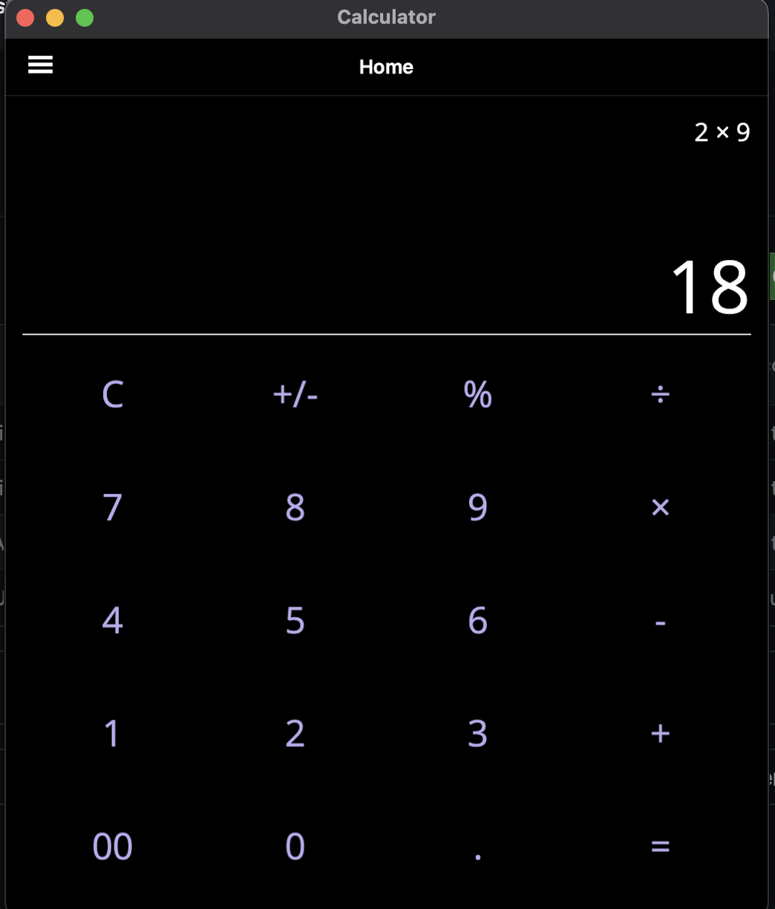
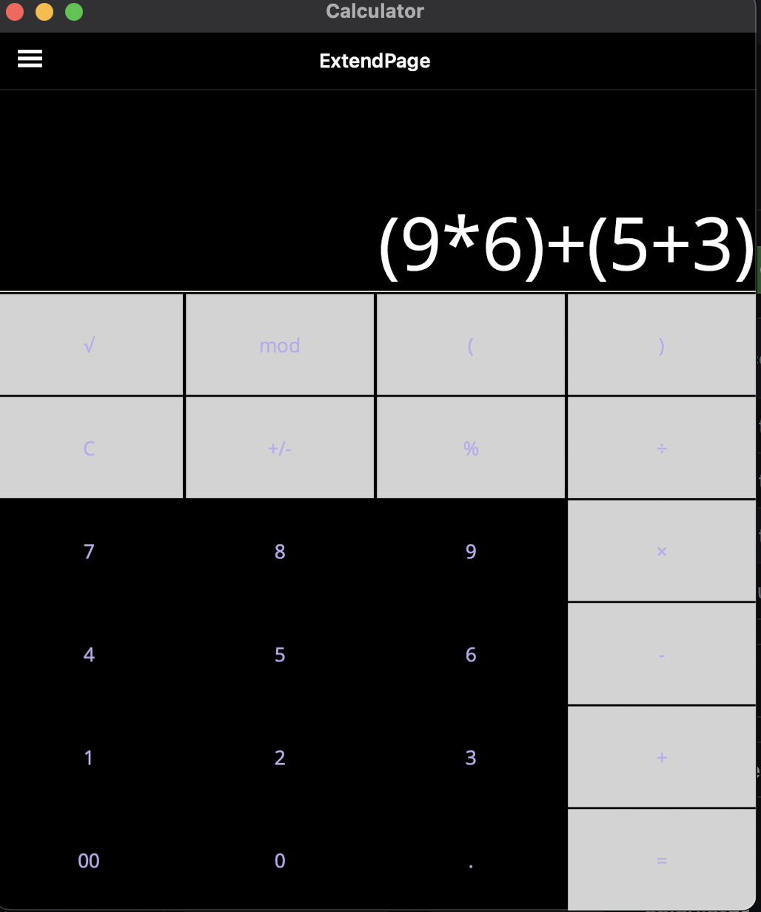
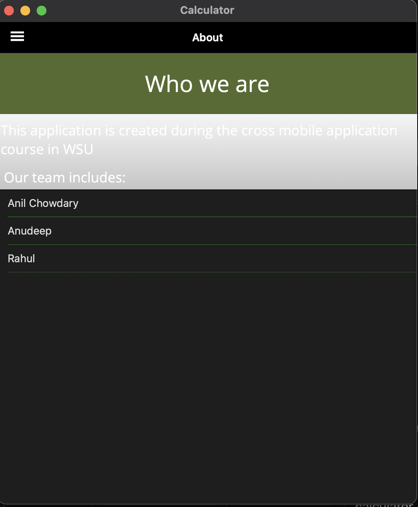
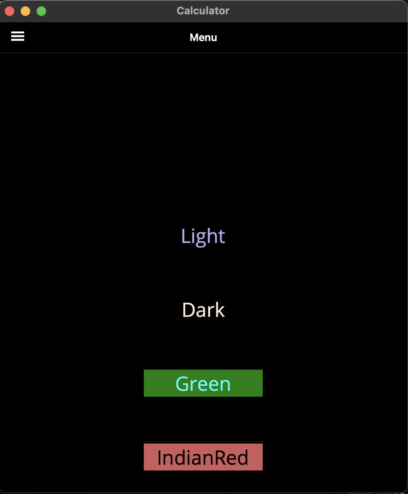

# Calculator Sample App

# Calculator
----
### Team Members: 
anil
anudeep
Rahul

----
### Teammate's Contribution:  

#### Anil
 
  
  ##### Assignment2:
  1. Flyout add
  2. General Style for the exercise Page
  3. Load Question and answer
  4. Documentation
  
#### Anudeep
 

  ##### Assignment2:
1. Validate answer based
2. Logic for Correct answer
3. Logic for incorrect answer
4. 	Try again
5. 	Skip to Next
6. Next quiz

#### Rahul

  ##### Assignment2:
  1. API implementation:
  2. API skeleton
  3. API call from UI

----
### Images:  
 
 

  #### Assignment2: 

